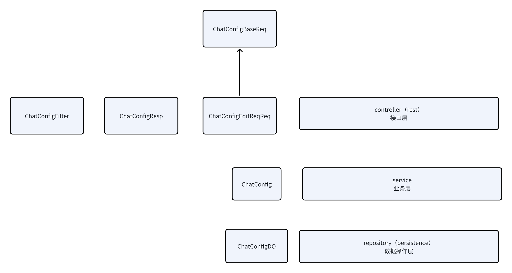

## MVC三层架构使用类分层做数据隔离
看了supersonic项目的代码，发现不愧是大厂，对于三层架构的类设计可以借鉴一下
MVC被分为controller、service、repository、mapper四层
- controller：req、resp对象
- service：实体对象
- repository（主要做类的转换）、mapper：DO对象

比如一个新增接口，
controller：baseReq对象
service：实体对象
repository：DO对象

根据封装的特性，应该是方法内部进行入参和出参的转换

严格起来这样很麻烦，这样做的目的是为了在三层架构里，每一层只关注自己的数据，不要导致像一些不该出现的字段直接放到接口返回值了
大型项目，很多人去完成这个项目，就适合这样的架构
在方便灵活和规范二者达到平衡

**这个东西是要做的，不然项目长期维护就越做越烂了，需要保证之后的维护不会太复杂的情况下保持灵活**
这里面最重要的是避免所有逻辑都放在一个类里，导致字段的耦合，以后就扩展不了
- 单独建立req、resp类：数据库类不要直接是接口的入参/返回类、接口的入参与返回类应该是分开的
- 统一控制数据库操作：数据库操作最好有单独的层，方便以后做扩展，不要和业务层纠扯不清

其他的就没有那么重要去遵循规则，重要的就是追求维护难度与灵活性的平衡
比如新增的时候数据库层用ChatDO，业务层用Chat，这就没有必要
比如查询，入参类到实际查询肯定需要一层转换，但如果要做又想简单一点的时候其实可以放repository层做一次就可以

参考supersonic项目：
