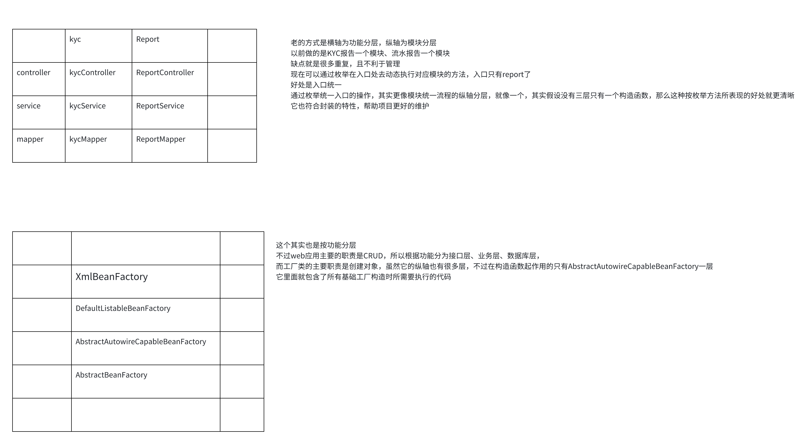

# 工厂模式的意义

在spring中，获取一个对象基本的代码就是
1. 读取xml文件
2. 通过xml文件创建beanFactory
3. 通过beanFactory得到bean也就是对象

这样看肯定比new一个对象要复杂，那**它究竟是为了解决什么问题呢？**

在正常情况，我需要一个对象，new一下就好了，但是实操情况会发现做了很多不必要的new代码，这时候就想到了工厂模式，但工厂模式还是会有创建代码，所以还是需要，但是对于复杂对象，我还需要在new的时候给一些属性设置，这样我最好能改造空构造器设置默认属性

问题1：假设在三层架构中，就会发现多余代码new太多了，并且new复杂对象也很麻烦，最好是能封装起来，我不用管对象的创建，甚至在业务代码不出现创建代码
```
public class MyController {
    public List<String> selectUserList(){
        MyService myService = new MyService();
        return myService.selectUserList();
    }
    
    
    @Test
    public void get(){
        selectUserList().forEach(System.out::println);
    }
}
```
这时就会考虑用属性的方式引入对象，不过这相当于把所有类下属性的创建封装到一个地方去处理，那就是工厂模式

和mybatis一样，其实本质就是使用封装特性解决问题，不过关键在于它是怎么设计项目才能达到功能又便于管理？

当要new一个有着复杂依赖关系的对象，比如A依赖B、B依赖C，这样我要先new ABC，然后再按顺序设置好属性，虽然可以和上面一样在构造器实现，但不灵活，要是能用配置的方式完成就好了

spring有一个BeanFactory，它是工厂模式的核心，它是一个接口，有很多不同的方式创建工厂，比如通过解析xml创建工厂的 XmlBeanFactory
它通过spring特有的解析资源类Resource来生成 XmlBeanFactory，值得说的是它的构造方法其实还有一个parentBeanFactory参数，也就是说BeanFactory也不是平级的，而是有层架关系的，并且它不单单是从xml创建bean那么简单
构造方法的super方法十分有意思，它被嵌套了很多层，但这些层都是通过不同的类进行分层，下面列举了有哪些层，这些层又做了什么

```
XmlBeanFactory xml Bean工厂类 这里主要看构造方法的super方法
||
DefaultListableBeanFactory 默认可列出的Bean工厂 没有什么操作
||
AbstractAutowireCapableBeanFactory 抽象自动布线bean工厂
    ignoreDependencyInterface 忽略依赖接口 把Bean名字感知、Bean所在工厂感知、Bean的类加载器感知，这三个应该都是创建一个Bean所需要的加上的接口，不过为什么会在这里被加到一个set里？
    NativeDetector.inNativeImage() 判断当前环境来选择简单实例化、cglib实例化策略两种实例化策略，这个不深入
    setParentBeanFactory 设置父bean工厂，这就是实现功能的代码
||
AbstractBeanFactory
```


通过类的层层继承来对一个功能做分层调用实现封装特性，这就是项目管理

比如我们公司最核心的报告，我就需要一个报告工厂，把使用方与创建方分开

我正常的流程是要做一个企业kyc报告，我需要创建企业kyc表和实体类、controller层、service层，
然后提供一个入口接口进行入库
做一个定时任务轮询报告主表，调用实际生成报告服务，报告生成好后改变状态
提供一个报告记录列表接口

报告会有的字段
状态
编号
历史报告表

报告会有的流程
报告入库入口
Report.insert

### 项目分层
本来我要实现一个web应用，就是一条竖着的线走下来，但是线多了就不易于管理，还有很多重复代码
所以按功能横向分层，每层只关注自己的功能，这样要找想要的东西就可以去对应的层找就行了
然后虽然能分三层了，但是线多了还是不便于管理，而且有些模块是耦合的，所以就用枚举纵向合并
入口只需要根据配置走实例线，实现者也只需要实现自己的实例线需要的方法而不需要管整个流程了
这个思路也可以用在项目结构设计上，比如我们公司的报告模块，比如我负责的融资服务，有产品、授信、融资、贷后、营销这五个模块，那我的controller、service、mapper就可以根据实际开发、维护过程来看是最外层为横轴，还是最外层为竖轴
我认为我的那个项目，每个模块关联性很强，所以还是最外层放横层比较好，如果是相互独立的话就可以考虑纵层了


